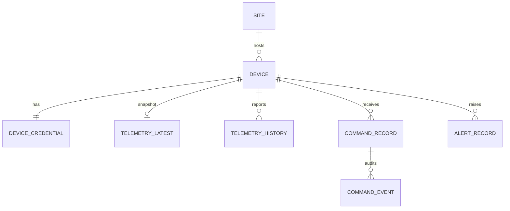

# ERD (logical)

```mermaid
erDiagram
  SITE ||--o{ DEVICE : hosts
  DEVICE ||--|| DEVICE_CREDENTIAL : has
  DEVICE ||--o| TELEMETRY_LATEST : snapshot
  DEVICE ||--o{ TELEMETRY_HISTORY : reports
  DEVICE ||--o{ COMMAND_RECORD : receives
  COMMAND_RECORD ||--o{ COMMAND_EVENT : audits
  DEVICE ||--o{ ALERT_RECORD : raises
```
